# Mermaid диаграммы реализации amoCRM для клиники Практик

Документ содержит рабочие Mermaid-схемы, которые иллюстрируют архитектуру интеграций, путь пациента, пять воронок amoCRM и роли. Все схемы рендерятся в любом просмотрщике Markdown с поддержкой Mermaid (GitHub, Obsidian, VS Code и т.д.).

---

## 1. Общая архитектура интеграций

```mermaid
flowchart LR
    subgraph SRC["Источники заявок"]
      direction TB
      S1["Яндекс Директ\nпоиск, РСЯ, ретаргетинг"]
      S2["VK Реклама,\nVK сообщество, VK органика"]
      S3["Геоагрегаторы\nЯндекс Карты, 2ГИС"]
      S4["Медагрегаторы\nНапоправку, Продокторов"]
      S5["SEO\nсайт, блог, услуги"]
      S6["Прямые\nзвонок, бренд, сайт"]
      S7["Рекомендации"]
      S8["Офлайн\nвывеска, листовка"]
      S9["Повторные пациенты"]
      S10["Реактивация базы"]
    end

    SRC -->|звонок, форма, чат| CT["Calltouch\nUTM, источник, запись"]
    CT -->|обращение, UTM| AL["Альбато\nOAuth, маппинг"]
    AL -->|сделка, контакт| AMO["amoCRM\nворонки, задачи, SLA"]

    DP["DentalPRO\nрасписание, медкарта,\nплан, оплаты, факт визита"] -->|webhook статусов| AMO
    AMO -->|статус сделки| AL
    AL -->|обратная аналитика| CT

    AMO --> R1["Руководитель"]
    AMO --> R2["Координатор лечения"]
    AMO --> R3["Маркетолог"]
    AMO --> R4["Администратор"]

    classDef amo fill:#e8f1fc,stroke:#1e6fd9,color:#1d2733;
    classDef dental fill:#e5f5ec,stroke:#1f8f5a,color:#1d2733;
    classDef calltouch fill:#efe7f7,stroke:#7a3fb6,color:#1d2733;
    classDef albato fill:#fdf0e0,stroke:#e07b1a,color:#1d2733;
    classDef src fill:#f4f6f9,stroke:#cfd6df,color:#1d2733;

    class AMO amo;
    class DP dental;
    class CT calltouch;
    class AL albato;
    class S1,S2,S3,S4,S5,S6,S7,S8,S9,S10,SRC src;
```

---

## 2. Путь пациента

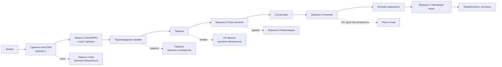

---

## 3. Воронка 1. Первичные обращения

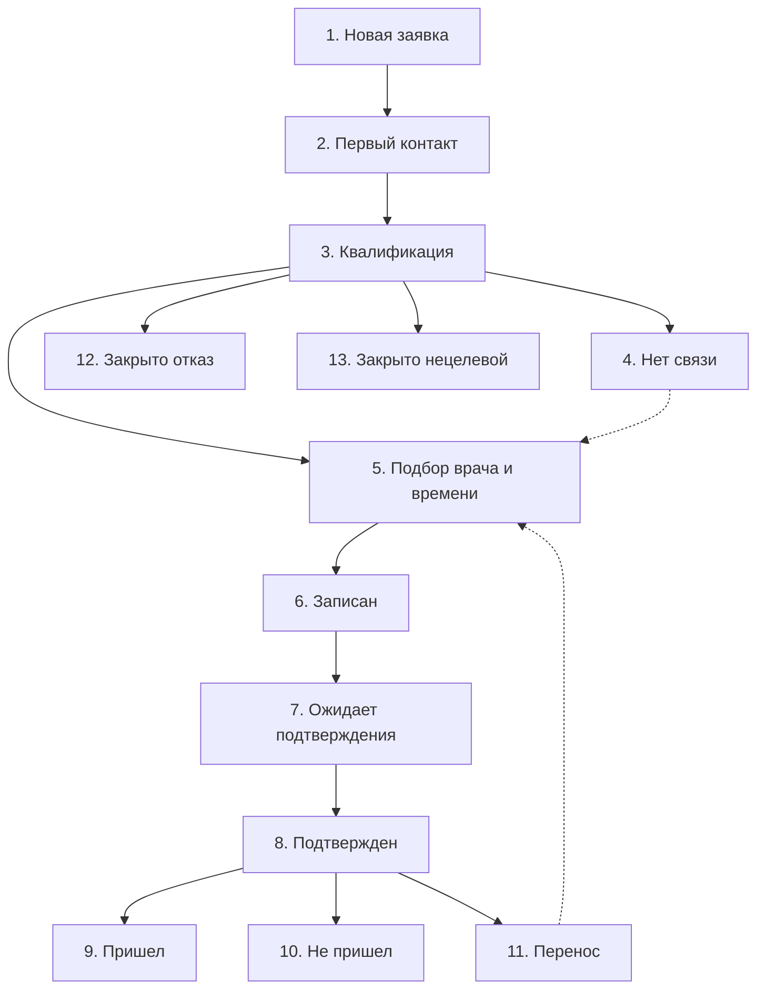

---

## 4. Воронка 2. План лечения

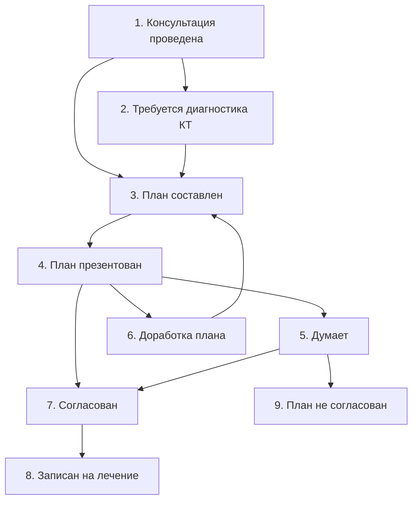

---

## 5. Воронка 3. Лечение

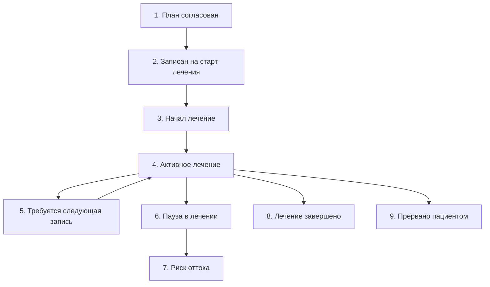

---

## 6. Воронка 4. Повторные визиты и профгигиена

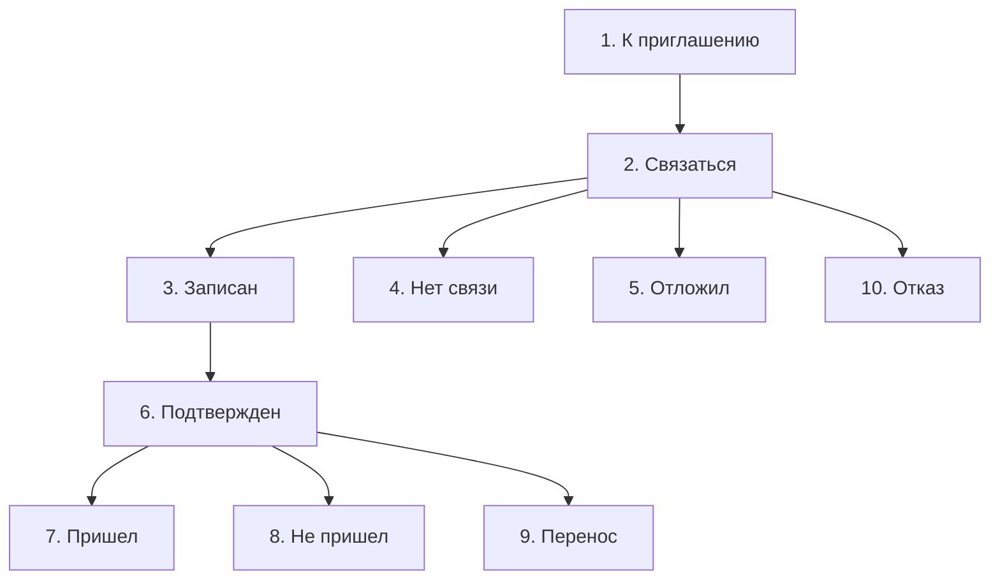

---

## 7. Воронка 5. Реактивация базы

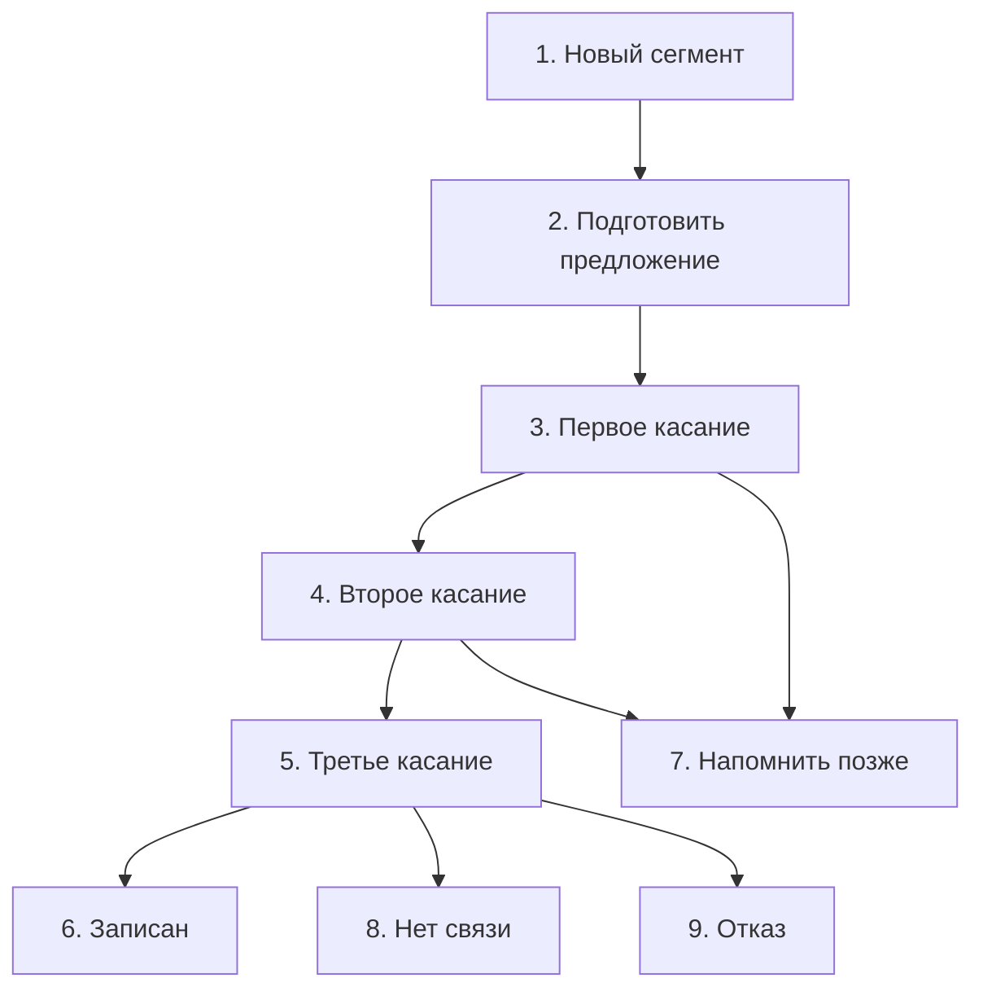

---

## 8. Поток Calltouch -> Альбато -> amoCRM

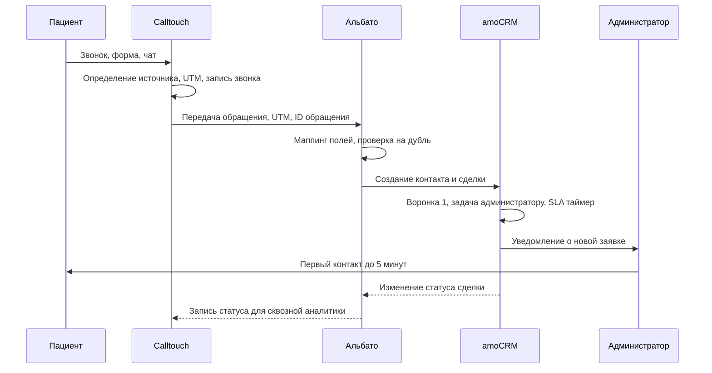

---

## 9. Поток DentalPRO -> amoCRM

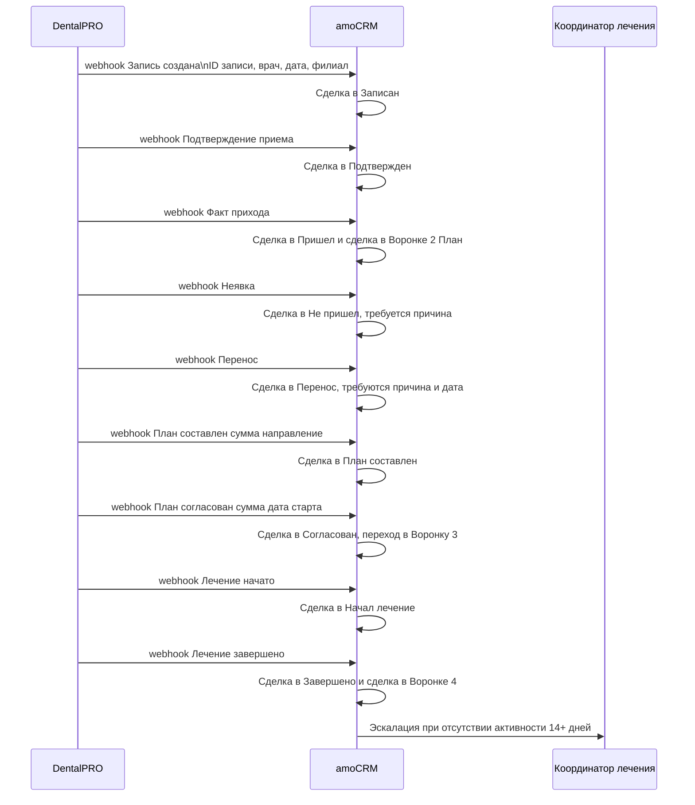

---

## 10. Карта ролей и ответственности

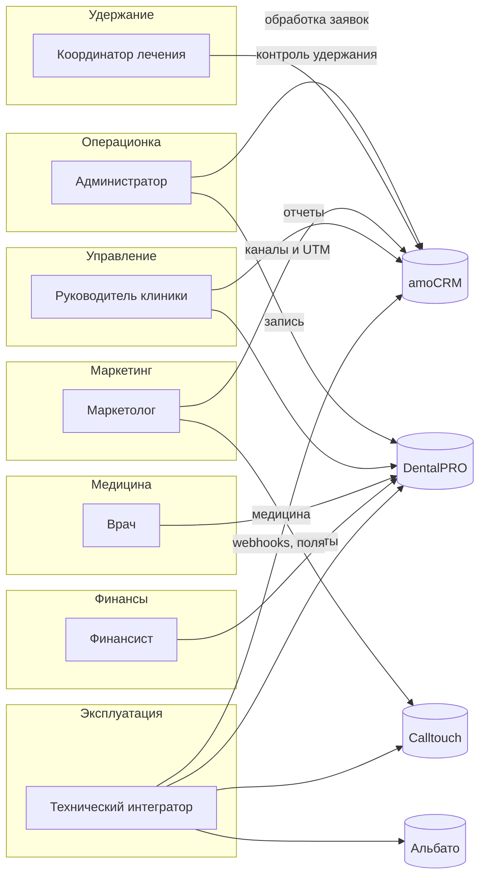

---

## 11. Карта отчетов

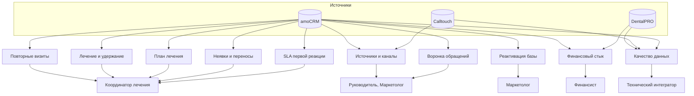
